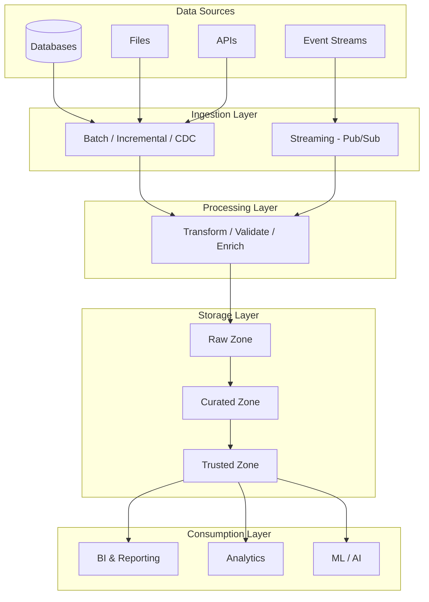
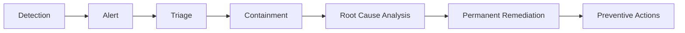

# Enterprise Data Platform — Reference Architecture

A reference architecture for designing and operating a scalable, secure, and reliable enterprise data platform supporting batch and streaming data, analytics, data governance, observability, and AI workloads.

## Overview

Modern enterprises need a data platform that can ingest data from diverse sources, process it at scale, enforce quality and governance, and provide reliable access to analytics and AI consumers.

This project presents a cloud-native reference architecture built on these principles:

- Scalable data ingestion and processing
- Separation of storage and compute
- Batch and event-driven data pipelines
- Strong data quality and governance
- Secure data access and protection
- Platform observability and operational reliability
- Self-service data consumption
- Cost-aware infrastructure management
- Extensibility for analytics and AI workloads

## Architecture Goals

| Capability | Objective |
|---|---|
| Data Ingestion | Support files, databases, APIs, and event streams |
| Data Processing | Enable scalable batch and streaming processing |
| Data Storage | Provide durable, governed analytical storage |
| Data Quality | Detect and prevent unreliable data from reaching consumers |
| Governance | Establish ownership, lineage, classification, and access controls |
| Security | Protect sensitive data through identity, encryption, and least-privilege access |
| Observability | Monitor pipelines, infrastructure, data quality, and platform health |
| Reliability | Establish SLAs, incident management, recovery, and continuity practices |
| Self-Service | Enable engineering and analytics teams to consume trusted data |
| Cost Management | Optimize compute, storage, and workload utilization |
| AI Readiness | Provide governed data foundations for ML and AI workloads |

## High-Level Architecture

**Cross-cutting capabilities** applied to every layer: Security & IAM · Governance & Metadata · Data Quality · Observability · Reliability · CI/CD · Cost Management

## Platform Layers

### 1. Source Layer

The platform supports multiple enterprise data sources:

- Relational databases
- Operational applications
- Files
- APIs
- Event streams
- External data providers

Standardized ingestion patterns isolate source-specific characteristics from downstream consumers.

### 2. Ingestion Layer

Reusable mechanisms for:

- Batch ingestion
- Incremental extraction
- Change data capture (CDC)
- Event-driven ingestion
- Schema validation
- Error handling
- Retry and replay

The goal is to prevent every consuming team from building its own ingestion framework.

### 3. Processing Layer

- Transformation and standardization
- Enrichment and aggregation
- Data validation
- Business-rule application

Distributed frameworks such as Apache Spark or cloud-native processing services are selected based on workload characteristics.

### 4. Storage Layer

Data is organized into logical zones:

| Zone | Purpose |
|---|---|
| **Raw** | Original source-aligned data retained for traceability and replay |
| **Curated** | Standardized, validated data optimized for analytical workloads |
| **Trusted** | Business-ready datasets with defined ownership, quality expectations, and governance |

This separation supports both engineering needs and business-facing consumption.

### 5. Consumption Layer

- Business intelligence and operational reporting
- Advanced analytics and data science
- Machine learning and AI applications
- Downstream applications

Access is provided through governed interfaces, not uncontrolled direct access to underlying infrastructure.

## Key Design Decisions & Trade-offs

| Decision | Choice | Rationale | Trade-off |
|---|---|---|---|
| ETL vs ELT | ELT for most workloads | Raw data retained for replay; transformations versioned in code | Higher storage cost; requires strong governance on raw zone |
| Batch vs Streaming | Batch by default, streaming where freshness SLA < 15 min | Streaming adds operational complexity; use only where the business needs it | Two processing patterns to support |
| Centralized vs Domain-owned data | Central platform, domain-owned datasets | Platform team owns tooling and standards; domains own data and quality | Requires clear ownership model and enforcement |
| Access control model | Role-based, least privilege, group-managed | Scales better than per-user grants; auditable | Initial role design takes effort |
| Schema changes | Contract-based with validation at ingestion | Prevents silent downstream breakage | Producers must coordinate changes |

## Data Governance

Governance is a platform capability, not a separate downstream process.

- Data ownership
- Data classification
- Metadata management
- Data lineage
- Access control
- Retention policies
- Data quality rules
- Auditability

Every critical dataset has an identifiable owner and defined quality expectations.

## Data Quality

Quality is evaluated throughout the lifecycle, not only after data reaches consumers.

| Dimension | Example Check |
|---|---|
| Completeness | Required fields are not null |
| Accuracy | Values reconcile to source totals |
| Validity | Values conform to allowed formats and ranges |
| Timeliness | Data lands within its freshness SLA |
| Uniqueness | No duplicate business keys |
| Consistency | Same entity matches across datasets |

Quality failures generate actionable alerts and stop unreliable data from silently propagating downstream.

## Security

Defense-in-depth approach:

- Least-privilege access
- Role-based authorization
- Encryption in transit and at rest
- Sensitive-data classification
- Network controls
- Secrets management
- Audit logging
- Separation of duties

Security is built into the architecture and CI/CD lifecycle, not treated as a final deployment check.

## Observability & Reliability

| Dimension | Signals |
|---|---|
| **Infrastructure** | CPU/memory, storage utilization, network health, compute availability |
| **Pipeline** | Success/failure, latency, throughput, backlog, retry rates |
| **Data** | Freshness, record volumes, quality-rule failures, schema changes, anomalies |

### Example Service Level Objectives

| Objective | Target |
|---|---|
| Pipeline availability | ≥ 99.9% |
| Critical data freshness | ≤ 30 minutes |
| Critical pipeline recovery | ≤ 60 minutes |
| Data quality exceptions | Below defined threshold |

## Incident Management

The objective is not simply to restore service. Repeated incidents should drive architectural, engineering, or operational changes that reduce the chance of recurrence.

## CI/CD & Engineering Standards

- Source control and branching strategy
- Code review
- Automated testing
- Build automation
- Security validation
- Infrastructure validation
- Deployment automation and environment promotion
- Rollback procedures

Reusable standards reduce duplicated effort and improve consistency across teams.

## Cost Management

Cloud data platforms can generate significant cost through compute, storage, data movement, and inefficient workloads.

- Workload monitoring and cost attribution
- Compute right-sizing and autoscaling
- Query optimization
- Storage lifecycle policies
- Workload prioritization
- Removal of unused resources
- Capacity planning

Cost is an architectural concern alongside performance, reliability, and security.

## AI & ML Readiness

The platform provides governed data foundations for AI and ML workloads:

- Feature generation and training datasets
- Vector and embedding pipelines
- Metadata enrichment
- Retrieval pipelines for LLM applications
- Agent-based workflows

AI workloads inherit the same security, governance, observability, and data-quality controls as traditional analytics.

## Architecture Principles

1. Build platforms, not one-off pipelines
2. Separate storage from compute
3. Treat data quality as an engineering responsibility
4. Make governance part of the platform
5. Automate operational controls wherever possible
6. Design for observability from the beginning
7. Use standardized interfaces and reusable patterns
8. Optimize for reliability as well as delivery speed
9. Treat cloud cost as an architectural concern
10. Design data platforms to support future AI workloads

## Roadmap

- [ ] Infrastructure as Code
- [ ] Sample batch ingestion pipeline
- [ ] Streaming pipeline (Pub/Sub)
- [ ] BigQuery implementation
- [ ] Automated data-quality framework
- [ ] Data lineage implementation
- [ ] CI/CD pipeline
- [ ] Monitoring dashboards
- [ ] Disaster-recovery demonstration
- [ ] AI/LLM data workflow

## Disclaimer

This repository is an independent portfolio project. It contains no proprietary, confidential, or internal information from any employer or client.
